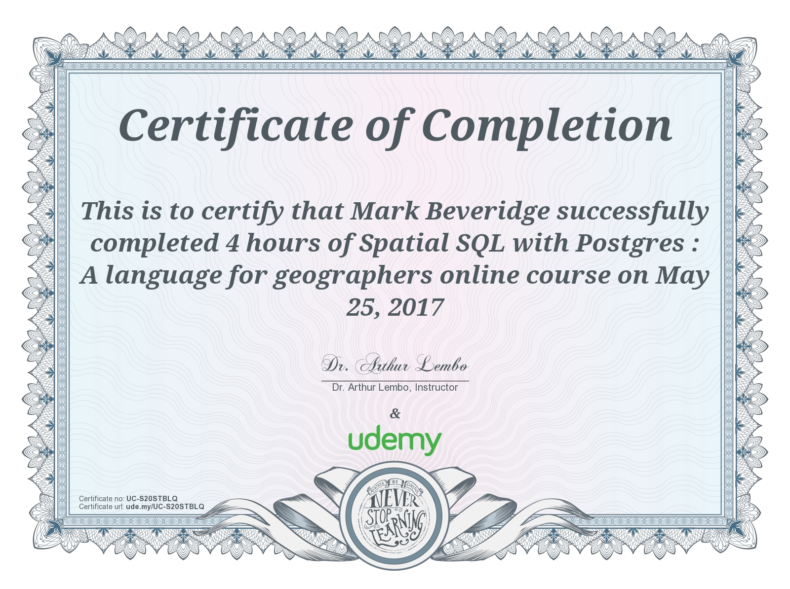

# Arthur Lembo : "[Spatial SQL with Postgres : A language for geographers](https://www.udemy.com/spatialsql/learn/v4/overview)"
###### Completed course : 25/5/17 ; 26/2/18

_"This course is designed to teach you how to write SQL to replicate many database and GIS tasks. We will start at a very basic overview, and then proceed to more advanced topics."_

_"Develop SQL queries that perform advanced GIS tasks, some of which might be impossible to perform in the GUI."_

_"This is a very comprehensive course that should take multiple days to complete"_

## Syllabus
### Section 3 : Overview of SQL
* Lecture 04 : Overview of SQL
* Lecture 05 : A basic introduction to some SQL with GIS data

### Section 4 : SQL Data Types
* Lecture 06 : Part I: Numeric, Boolean, Text
* Lecture 07 : Part II: Date & Time, Spatial

### Section 5 : Traditional SQL
* Lecture 08 : SELECT, WHERE, conditional expressions, and GROUP BY
* Lecture 09 : More fun with GROUP BY
* Lecture 10 : CASE statements
* Lecture 11 : Aggregate functions (average, standard deviation, count, min, max...)
* Lecture 12 : Other SQL commands (Order, LIMIT, OFFSET, BETWEEN)
* Lecture 13 : Changing data (DROP, CREATE, INSERT, ALTER, UPDATE)
* Lecture 14 : Writing SQL functions

### Section 6 : Spatial SQL for Vector Geometry
* Lecture 15 : Coordinate system manipulation
* Lecture 16 : Adjacent, Buffer, Contains, Distance, Intersects
* Lecture 17 : Topological Overlay (Erase, Intersect, Identity)

### Section 7 : Spatial SQL for Geographic Analysis
* Lecture 18 : Distance, Adjacency and Interaction matrices
* Lecture 19 : Nearest Neighbor Index

